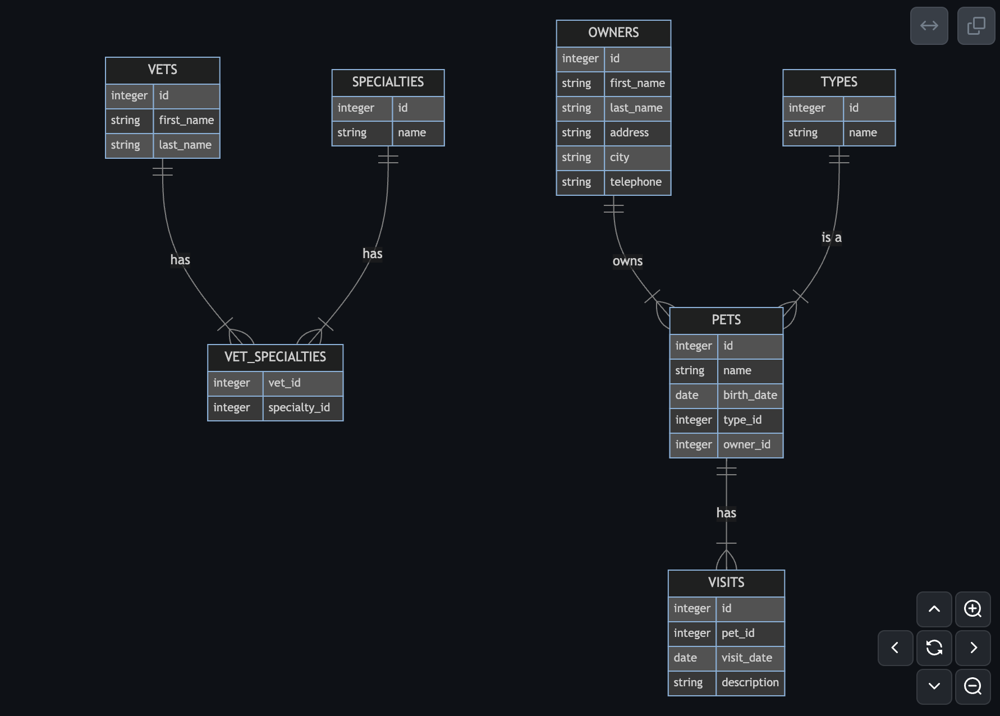

# Generating Documentation

As you probably know GitHub allow you to use [Mermaid](https://mermaid.js.org/) to pubish diagram in markdown documentation.

In this lab you will see how to use GitHub Copilot to generate a ERD (Entity Relation Diagram) from the SQL files contains in the Petclinic Application. This will look like the following:

Possible Flow

1. Open the Github Copilot Chat
2. Create a new chat (with the `+` button at the top of the window)
3. Use the #file command, for example asking the following `Using the #file:schema.sql create an ERD Diagram with mermaid`

